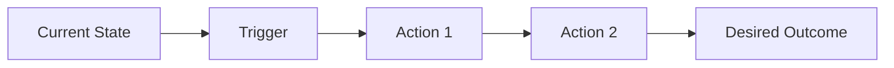
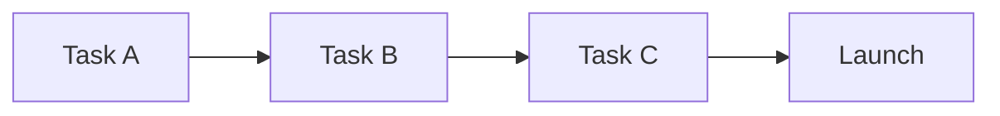

# Product Requirements Document (PRD): <Title>

| Section | What it covers |
|---------|----------------|
| [1. Document Metadata](#1-document-metadata) | Ownership, version, status, and related documents |
| [2. Executive Summary](#2-executive-summary) | One-paragraph overview of what and why |
| [3. Problem Statement](#3-problem-statement) | Current state, desired state, and the core problem |
| [4. Business Justification](#4-business-justification) | Why now and business-level success criteria |
| [5. User Research & Insights](#5-user-research--insights) | Personas, research sources, and key insights |
| [6. Goals & Objectives](#6-goals--objectives) | Primary goal, SMART objectives, and non-goals |
| [7. Use Cases & User Stories](#7-use-cases--user-stories) | Primary use cases and user stories |
| [8. Functional Requirements](#8-functional-requirements) | Numbered, testable system requirements |
| [9. Non-Functional Requirements](#9-non-functional-requirements) | Performance, scalability, security, reliability |
| [10. User Experience & Interface Design](#10-user-experience--interface-design) | User journey map and required UI components |
| [11. Technical Requirements](#11-technical-requirements) | Architecture, API specs, and data model changes |
| [12. Scope & Boundaries](#12-scope--boundaries) | What is in and out of scope this release |
| [13. Testing & Quality Assurance](#13-testing--quality-assurance) | Test strategy and test cases |
| [14. Success Metrics & KPIs](#14-success-metrics--kpis) | Product and engineering metrics |
| [15. Go-to-Market Plan](#15-go-to-market-plan) | Launch strategy and documentation requirements |
| [16. Risks & Mitigations](#16-risks--mitigations) | Technical and business risks with mitigations |
| [17. Dependencies & Blockers](#17-dependencies--blockers) | Critical path and cross-team dependencies |
| [18. Timeline & Milestones](#18-timeline--milestones) | Overall timeline and key dates |
| [19. Open Questions](#19-open-questions) | Unresolved questions with owners and due dates |
| [20. Appendix](#20-appendix) | Glossary, references, and change log |

## 1. Document Metadata

<!-- A table of ownership and versioning fields. Rows: Document Name, Version, Status,
     Created Date, Last Updated, Product Manager, Engineering Lead, Design Lead,
     Stakeholders, Related Documents (links to ADRs, specs, research). Keep the Status
     row in sync with the frontmatter `status`. -->

| Field | Value |
|-------|-------|
| **Document Name** | `<Feature Name> PRD` |
| **Version** | `v1.0` |
| **Status** | `Draft` |
| **Created Date** | `<YYYY-MM-DD>` |
| **Last Updated** | `<YYYY-MM-DD>` |
| **Product Manager** | `<Name>` |
| **Engineering Lead** | `<Name>` |
| **Design Lead** | `<Name>` |
| **Stakeholders** | `<List of key stakeholders>` |
| **Related Documents** | `<Links to ADRs, specs, research>` |

## 2. Executive Summary

<!-- One paragraph. Answer: what are we building, for whom, and why now? -->

## 3. Problem Statement

<!-- Sub-sections below; delete any you leave empty (R10). -->

### Current State

<!-- The situation today and the pain points that exist. -->

### Desired State

<!-- What the world looks like after this feature ships. -->

### Problem Statement

<!-- The crisp statement: [User segment] experiences [pain point] when [context];
     this causes [negative impact]; we need [solution] so that [desired outcome]. -->

## 4. Business Justification

<!-- Sub-sections below; delete any you leave empty (R10). -->

### Why Now?

<!-- A comparable-records table of drivers: Market Opportunity, Competitive Pressure,
     Customer Demand, Strategic Alignment — each with a description (R7). -->

### Success Criteria (Business Level)

<!-- Checklist of measurable business outcomes, each with a target. -->

## 5. User Research & Insights

<!-- Sub-sections below; delete any you leave empty (R10). -->

### User Personas

<!-- A comparable-records table: Persona, Description, Goals, Pain Points (R7). -->

### Research Sources

<!-- Checklist: user interviews, survey data, usage analysis, competitive analysis,
     support-ticket analysis. -->

### Key Insights

<!-- Numbered list of the most important findings. -->

## 6. Goals & Objectives

<!-- Sub-sections below; delete any you leave empty (R10). -->

### Primary Goal

<!-- Single sentence stating the main objective. -->

### SMART Objectives

<!-- A comparable-records table: Objective, Success Metric, Target, Measurement Method (R7). -->

### Non-Goals

<!-- Checklist of things this release explicitly will NOT do. -->

## 7. Use Cases & User Stories

<!-- Sub-sections below; delete any you leave empty (R10). -->

### Primary Use Cases

<!-- One record per use case (Actor, Precondition, Trigger, Main Flow,
     Alternative Flows, Postcondition). -->

### User Stories

<!-- Epics broken into stories in "As a <role>, I want <action>, so that <value>" form,
     each with acceptance criteria, priority (MoSCoW), and story points. -->

## 8. Functional Requirements

<!-- One ### sub-section per requirement (FR-1, FR-2, ...). Each carries ID, Description,
     Priority (Must/Should/Could), Dependencies, and Acceptance Criteria. Each must be
     independently testable. -->

### FR-1: <Requirement Name>

<!-- ID / Description / Priority / Dependencies / Acceptance Criteria for this requirement. -->

## 9. Non-Functional Requirements

<!-- Sub-sections below; delete any you leave empty (R10). Each is a comparable-records
     table of Requirement, Target, Measurement (R7). -->

### Performance

<!-- Performance requirements with targets and measurement methods. -->

### Scalability

<!-- Scalability requirements with targets and measurement methods. -->

### Security

<!-- Security requirements with targets and measurement methods. -->

### Reliability

<!-- Reliability requirements with targets and measurement methods. -->

## 10. User Experience & Interface Design

<!-- Sub-sections below; delete any you leave empty (R10). -->

### User Journey Map

<!-- Replace the placeholder mermaid flowchart below with the real journey: current state
     -> trigger -> actions -> desired outcome. Use a mermaid diagram, never an ASCII/fenced
     flow diagram (R8). -->

### UI Components Required

<!-- A comparable-records table: Component, Description, Priority (R7). -->

## 11. Technical Requirements

<!-- Sub-sections below; delete any you leave empty (R10). -->

### Architecture Overview

<!-- A comparable-records table: Component, Responsibility, Technology (R7). -->

### API Specifications

<!-- A comparable-records table: Endpoint, Method, Auth, Request, Response (R7).
     Be explicit about request/response schemas. -->

### Data Model Changes

<!-- A comparable-records table: Entity, Changes, Impact — note whether a migration is
     needed (R7). -->

## 12. Scope & Boundaries

<!-- Sub-sections below; delete any you leave empty (R10). -->

### In Scope

<!-- Checklist of what this release will deliver, with detail. -->

### Out of Scope (This Release)

<!-- Checklist of deferred / excluded items, with the reason (vNext, separate initiative,
     will not be done). -->

## 13. Testing & Quality Assurance

<!-- Sub-sections below; delete any you leave empty (R10). -->

### Test Strategy

<!-- A comparable-records table: Test Type (Unit/Integration/E2E), Scope, Owner, Tools (R7). -->

### Test Cases

<!-- A comparable-records table: ID, Scenario, Expected Result, Priority (P0/P1/P2) (R7). -->

## 14. Success Metrics & KPIs

<!-- Sub-sections below; delete any you leave empty (R10). -->

### Product Metrics

<!-- A comparable-records table: Metric, Current (baseline), Target, Timeline, Owner (R7). -->

### Engineering Metrics

<!-- A comparable-records table: Metric, Target, Measurement — e.g. uptime, response time,
     error rate (R7). -->

## 15. Go-to-Market Plan

<!-- Sub-sections below; delete any you leave empty (R10). -->

### Launch Strategy

<!-- Launch type (Beta/Limited/Full/Phased), target audience, and enablement approach. -->

### Documentation Requirements

<!-- Checklist: user-facing docs, API docs, internal runbooks, release notes. -->

## 16. Risks & Mitigations

<!-- Sub-sections below; delete any you leave empty (R10). Each is a comparable-records
     table: Risk, Probability, Impact, Mitigation, Contingency (R7). -->

### Technical Risks

<!-- Technical risks with probability, impact, mitigation, and contingency. -->

### Business Risks

<!-- Business risks with probability, impact, mitigation, and contingency. -->

## 17. Dependencies & Blockers

<!-- Sub-sections below; delete any you leave empty (R10). -->

### Critical Path

<!-- Use a mermaid flowchart to show the ordered critical path (task A -> task B -> ...
     -> launch). Use a mermaid diagram, never an ASCII/fenced flow diagram (R8). -->

### Cross-Team Dependencies

<!-- A comparable-records table: Dependency, Owner, Status (Ready/Blocked), Unblock Date (R7). -->

## 18. Timeline & Milestones

<!-- Sub-sections below; delete any you leave empty (R10). -->

### Overall Timeline

<!-- A comparable-records table: Milestone, Target Date, Dependencies, Status (R7). -->

### Key Dates

<!-- Kickoff, Design Freeze, Code Freeze, Beta Launch, GA Launch. -->

## 19. Open Questions

<!-- A table of unresolved questions. Columns: Question, Asked By, Priority (P0/P1/P2),
     Owner, Due Date, Status (Open/Resolved). -->

| Question | Asked By | Priority | Owner | Due Date | Status |
|----------|----------|----------|-------|----------|--------|
| <Question 1> | <Who> | `P0/P1/P2` | <Who> | <YYYY-MM-DD> | `Open/Resolved` |

## 20. Appendix

<!-- Sub-sections below; delete any you leave empty (R10). -->

### Glossary

<!-- A comparable-records table: Term, Definition (R7). -->

### References

<!-- Links to related ADRs, specs, research, and external sources. -->

### Change Log

<!-- A comparable-records table: Version, Date, Author, Changes (R7). -->
